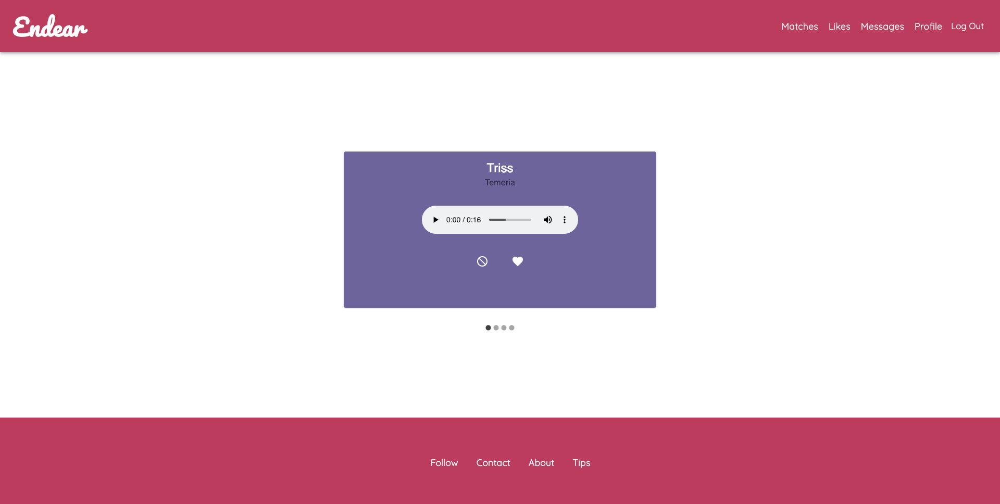

# Prime Solo Project - Endear

## Description

Duration: 2 Week Sprint

Inspired by the hit Netflix Original "Love is Blind", Endear is a dating app that gives people the unique opportunity to connect deeply though voice, before ever meeting. The dating app allows singles to match based off of a recorded audio clip that they upload to the web application.

## Screen Shot

## Prerequisites

Before you get started, make sure you have the following software installed on your computer:

- [Node.js](https://nodejs.org/en/)
- [PostrgeSQL](https://www.postgresql.org/)
- [Nodemon](https://nodemon.io/)

## Installation

1. Create a database named 'endear'.
2. The queries in the database.sql file are set up to create all the necessary tables. The project is built on Postgres, so you will need to make sure to have that installed. We recommend using Postico to run those queries as that was used to create the queries.
3. Open up your editor of choice and run an npm install.
4. Run npm run server in your terminal.
5. Run npm run client in your terminal
6. The npm run client command will open up a new browser tab for you!

## Usage

1. On the landing page user can create an account or login. The registration process is 11 pages that takes in relevant profile information. At the end of the registration process the user will be logged in.
2. If a profile has been created then users can click on the 'Sign In' button on the top right of the navigation bar.
3. Once logged in users have the option of editing their profile details or phone number if they so choose.
4. On the matches link in the navigation bar users can click on the pass or like buttons to match with other users on the web application.
5. Once users are done, they can log out of the web application.

## Built With

- Postgres
- Express
- Node
- React
- Redux
- Redux- Saga
- Material UI
- react-dropzone-s3-uploader
- react-material-ui-carousel
- react-audio-player
- passport

## License

[MIT License](license.txt)

## Acknowledgment

Thanks to Prime Digital Academy who equipped and helped me to make this application a reality.

## Support

If you have suggestions or issues, please email me at anguyen1320@gmail.com
